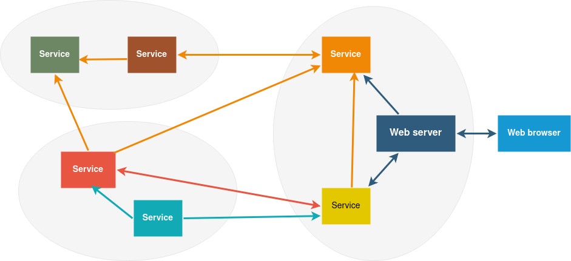

# Using gRPC to fight Mordor

## Hands on approach to use gRPC with C++

<br>
<br>

_Per-Magnus Holtmo_


---

# Micro service architecture



---

# Some alternatives

- REST - HTTP/1 and json
- MQTT
- RabbitMQ, ZeroMQ, Kafka,...
- Implement your own using raw sockets
- Some needs a broker process

or...

---

# We could use gRPC

- Created by Google, open source 2015
- An RPC framework supporting most languages
- Uses Google Protocol buffers for data serialization
- HTTP/2 as transport layer

---

# 'g' stands for Google, right?

---

# No, 'g' stands for...

- **1.0** 'g' stands for '**gRPC**'
- **1.1** 'g' stands for '**good**'
- **1.2** 'g' stands for '**green**'
- **1.3** 'g' stands for '**gentle**'
...
- **1.59** 'g' stands for '**generative**'
- **1.60** 'g' stands for '**gjallarhorn**'
- **1.61** 'g' stands for '**grand**'
- **1.62** 'g' stands for '**guardian**'

---

# Lord of the Rings game using gRPC

- Server exposing a gRPC interface
- Client applications
- Server interface library
- Synchronous and asynchronous examples
- Some message streaming

---

# Interface library

- Define interface in a protocol buffers file, `.proto`
- Generate `C++` code
- Make a library

---

# Interface messages - lotr.proto

```proto
package lotr.proto;

message MordorPopulation {
    uint64 orc_count = 1;
    uint32 troll_count = 2;
    uint32 nazgul_count = 3;
    bool sauron_alive = 4;
}

message Weapon {
    string name = 1;
    float power = 2;
}

message AttackResult {
    uint64 orcs_killed = 1;
    uint32 trolls_killed = 2;
    uint32 nazguls_killed = 3;
}
```

---

# Protocol buffers

Generate code for supported languages, e.g. as C++:
```sh
protoc -I include/path --cpp-out build/proto lotr.proto
```
Output:  `lotr.pb.h` and `lotr.pb.cc`

Serialize
```cpp
lotr::proto::Weapon weapon;
weapon.set_name("Sting");
const auto data = weapon.SerializeAsString();
```
Deserialize

```cpp
lotr::proto::Weapon weapon;
weapon.ParseFromString(data);
const auto name = weapon.name();
```

---

# Interface functions - RPC

gRPC makes additions to the `.proto` files to define a Service.


```proto
service LotrService {
    rpc mordor_population(google.protobuf.Empty) returns (MordorPopulation) {}
    rpc kill_orcs(Weapon) returns (AttackResult) {}
    rpc subscribeToStatus(google.protobuf.Empty) returns (stream GameStatus) {}
}
```

When running `protoc`

```sh
protoc --grpc_out=build/proto --plugin=protoc-gen-grpc=grpc_cpp_plugin lotr.proto
```
Output: `lotr.grpc.pb.h` and `lotr.grpc.pb.cc`

---

# Make a library with the interface code

Contains proto files and optional C++ helper types
Exposes needed headers for both server and client

```cmake
include(../cmake/grpc.cmake)

generate_proto_cpp(lotr-proto protos/lotr.proto)
```

---

# Server and Service concepts

A **Server** exposes one or more **services** on a port

- **Service** must inherit from a generated class (several options)
- Create a `grpc::Server` and add a service instance
- Start the server on the "ip:port" to listen on
- The server runs until shutdown by other thread

---

# Synchronous service definition

```cpp

#include <lotr.grpc.pb.h>

class SyncService : public proto::LotrService::Service
{
public:
    grpc::Status mordor_population(grpc::ServerContext* context,
                                   const google::protobuf::Empty* request,
                                   proto::MordorPopulation* response) override;
};
```
---

# Service implementation

```cpp
grpc::Status SyncService::mordor_population(grpc::ServerContext*,
                                            const google::protobuf::Empty*,
                                            proto::MordorPopulation* response)
{
    response->set_orc_count(2'345'543);
    response->set_troll_count(7'540);
    response->set_nazgul_count(9);

    return grpc::Status::OK;
}
```
---

# We need a Server to host the service


```cpp
class GrpcServer
{
public:
    GrpcServer(grpc::Service& service, std::string_view address, uint16_t port);

    void shutdown();

private:
    void run(grpc::Service& service, const std::string& listening_uri);

    std::thread m_server_thread;
    std::unique_ptr<grpc::Server> m_server;
};
```

---

# Server implementation

```cpp
void GrpcServer::run(grpc::Service& service, const std::string& listening_uri)
{
    grpc::ServerBuilder builder;
    builder.AddListeningPort(listening_uri, grpc::InsecureServerCredentials());
    builder.RegisterService(&service);
    m_server = builder.BuildAndStart();
    m_server->Wait();
}
```
```cpp
void GrpcServer::shutdown()
{
    if (m_server) {
        m_server->Shutdown();
        m_server_thread.join();
    }
}
```
---

# Time to make a client

<br>
<br>

Define
- Generic client, holding gRPC _channel_ and _stub_
- Specialized client


---

# Generic client helper

```cpp
template<typename Service>
class GrpcClient
{
public:
    GrpcClient(const std::string& server_url)
      : m_channel{ grpc::CreateChannel(server_url,
                   grpc::InsecureChannelCredentials()) }
      , m_stub{ Service::NewStub(m_channel) } {}

    Service::Stub& stub() { return *m_stub.get(); }

private:
    std::shared_ptr<grpc::Channel> m_channel;
    std::unique_ptr<typename Service::Stub> m_stub;
};
```

---

# Client definition

```cpp
class SyncClient
{
public:
    SyncClient(std::string_view address, std::uint16_t port);

    std::optional<proto::MordorPopulation> population();

private:
    GrpcClient<proto::LotrService> m_grpc_client;
};
```

---

# Client implementation

```cpp
Stub::mordor_population(grpc::ClientContext* context,
                        const google::protobuf::Empty& request,
                        proto::MordorPopulation* response);
```

```cpp
std::optional<proto::MordorPopulation> SyncClient::population()
{
    grpc::ClientContext context;
    google::protobuf::Empty request;
    proto::MordorPopulation response;

    const auto status = m_grpc_client.stub().
        mordor_population(&context, request, &response);

    if (!status.ok()) {
        return std::nullopt;
    }

    return response;
}
```

---

# ClientContext options

Set deadline, how long to wait until call is aborted
```cpp
context.set_deadline(std::chrono::system_clock::now() + 2s);
```

Compression
```cpp
context.set_compression_algorithm(GRPC_COMPRESS_GZIP);
```

Add meta data, http header key value pairs
```cpp
context.AddMetadata("custom-key", "Custom Value");
```

And credentials, cancellation, keep alive, "wait for ready", etc...

---

# Optional reflection


```cpp
grpc::reflection::InitProtoReflectionServerBuilderPlugin();
```

- List services, methods, arguments
- Call methods

---

# Demo


---

# But there is a problem...


---

# We need asynchronous message handling

**Do not use the suggested async api!**

<br>

_But there is a callback interface..._

---

# Asynchronous service definition

```cpp
class AsyncService : public proto::LotrService::CallbackService
{
public:
    AsyncService(boost::asio::io_context& context, const ServiceCallbacks& callbacks);

    grpc::ServerUnaryReactor* mordor_population(grpc::CallbackServerContext* context,
                                                const google::protobuf::Empty* request,
                                                proto::MordorPopulation* response) override;

    grpc::ServerUnaryReactor* kill_orcs(grpc::CallbackServerContext* context,
                                        const proto::Weapon* request,
                                        proto::AttackResult* response) override;
};
```

---

# Asynchronous service implementation

```cpp
grpc::ServerUnaryReactor* AsyncService::mordor_population(grpc::CallbackServerContext* context,
                                                          const google::protobuf::Empty*,
                                                          proto::MordorPopulation* response)
{
    auto reactor = context->DefaultReactor();

    boost::asio::post(m_io_context, [reactor, response, this] {
        const auto pop = m_callbacks.population();

        response->set_orc_count(pop.orc_count);
        response->set_troll_count(pop.troll_count);
        response->set_nazgul_count(pop.nazgul_count);
        response->set_sauron_alive(pop.sauron_alive);

        reactor->Finish(grpc::Status::OK);
    });

    return reactor;
}
```

---

# Service shutdown guard

```cpp
grpc::ServerUnaryReactor* AsyncService::kill_orcs(grpc::CallbackServerContext* context,
                                                  const proto::Weapon* request,
                                                  proto::AttackResult* response)
{
    auto reactor = context->DefaultReactor();

    if (m_shutting_down) {
        reactor->Finish(grpc::Status::CANCELLED);
        return reactor;
    }

    if (request->power() < 0 || request->power() > 1) {
        reactor->Finish({ grpc::StatusCode::INVALID_ARGUMENT, "Power must be between 0 and 1" });
        return reactor;
    }

    boost::asio::post(m_io_context, [reactor, request, response, this] {
        ...
        reactor->Finish(grpc::Status::OK);
    });

    return reactor;
}
```

---

# Asynchronous client definition

```cpp
class AsyncClient
{
public:
    AsyncClient(boost::asio::io_context& context,
                std::string_view address,
                std::uint16_t port);

    using KillHandler = std::function<void(const grpc::Status&, std::uint64_t)>;

    void kill_orcs(std::string_view weapon_name, float power, KillHandler handler);

private:
    boost::asio::io_context& m_io_context;
    GrpcClient<proto::LotrService> m_grpc_client;
};
```

---

# gRPC client callback interface

```cpp
Stub::async::kill_orcs(grpc::ClientContext* context,
                       const proto::Weapon* request,
                       proto::AttackResult* response,
                       std::function<void(grpc::Status)> f);
```

```cpp
template<typename Request, typename Response>
struct ClientState
{
    grpc::ClientContext context;
    Request request;
    Response response;
};
```

---

# Asynchronous client implementation

```cpp
void AsyncClient::kill_orcs(std::string_view weapon_name, float power, KillHandler handler)
{
    auto state =
      std::make_shared<ClientState<proto::Weapon, proto::AttackResult>>();

    state->request.set_name(std::string(weapon_name));
    state->request.set_power(power);

    m_grpc_client.stub().async()->kill_orcs(
      &state->context,
      &state->request,
      &state->response,
      [&io_context = m_io_context, state, handler = std::move(handler)](grpc::Status status) {
          boost::asio::post(
            io_context,
            [handler = std::move(handler), status, orcs_killed = state->response.orcs_killed()]() {
                handler(status, orcs_killed);
            });
      });
}
```

---

# Message streaming

- Unary calls basically all you need
  - Send large arrays of messages
  - Get state
- But some kind of event notification would be nice

<br>
<br>
<br>
<br>
<br>
<br>


---

# Server streaming

**RPC definition**
```proto
service LotrService {
    rpc subscribeToStatus(google.protobuf.Empty) returns (stream GameStatus) {}
}
```

**Method to override**
```cpp
grpc::ServerWriteReactor<proto::GameStatus>* subscribeToStatus(
      grpc::CallbackServerContext* context,
      const google::protobuf::Empty* request) override;
```

---

# Server streaming

* `MessageWriter` - writes one message at a time
* `StreamWriter` - handles several clients
* Update our service

---

# MessageWriter

```cpp
template<typename Message>
class MessageWriter : public grpc::ServerWriteReactor<Message>
{
public:
    MessageWriter(boost::asio::io_context& io, const DoneCallback& done)

    void send_message(const Message& msg)

    void OnWriteDone(bool ok) override
    void OnCancel() override
    void OnDone() override

private:
    std::optional<Message> m_message;
};
```

---

# MessageWriter sending messages

```cpp
void send_message(const Message& msg) {
    if (m_message || m_done) {
        return;
    }
    m_message = msg;
    StartWrite(&m_message.value());
}

void OnWriteDone(bool) override
{
    m_message.reset();
}
```
_Must guard members..._

---

# StreamWriter to handle multiple clients

```cpp
template<typename Message>
class StreamWriter
{
public:
    grpc::ServerWriteReactor<Message>* create_writer();

    void send_message(const Message& msg)

private:
    std::vector<Writer> m_writers;
};
```
---

# StreamWriter sending a message

```cpp
grpc::ServerWriteReactor<Message>* StreamWriter::create_writer()
{
    auto& w = m_writers.emplace_back(
                std::make_unique<MessageWriter<Message>>(...), ++m_id);

    return w.writer.get();
}

void StreamWriter::send_message(const Message& msg)
{
    std::ranges::for_each(m_writers,
        [&msg](auto& w) { w.writer->send_message(msg); });
}
```

---

# StreamWriter usage

```cpp
grpc::ServerWriteReactor<proto::GameStatus>* AsyncService::subscribeToStatus(..)
{
    return m_status_writer.create_writer();
}

void AsyncService::send_status(const GameStatus& s)
{
    proto::GameStatus status;

    status.set_mordor_strenght(s.mordor_strength);
    status.set_gondor_strenght(s.gondor_strength);
    status.set_orc_count(s.orc_count);

    m_status_writer.send_message(status);
}
```
---

# How to read streams

Generated client method
```cpp
void Stub::async::subscribeToStatus(grpc::ClientContext* context,
                                    const google::protobuf::Empty* request,
                                    grpc::ClientReadReactor<proto::GameStatus>* reactor)
```

---

# StreamReader - reading one message at a time

```cpp
template<typename Message>
class StreamReader : public grpc::ClientReadReactor<Message>
{
public:
    StreamReader(std::function<void(const Message&) message_handler, ...)

    void start();

    void OnReadDone(bool ok) override;
    void OnDone(const grpc::Status& status) override;

private:
    Message m_message;
};
```

---

# StreamReader message reading

```cpp
void StreamReader::start()
{
    StartCall();
    StartRead(&m_message);
}

void StreamReader::OnReadDone(bool ok) override
{
    if (ok) {
        boost::asio::post(m_io_context,
                          [this, msg = std::move(m_message)]() {
                              m_message_handler(msg); });
        StartRead(&m_message);
    }
}
```

---

# StreamReader usage

```cpp
void AsyncClient::subscribeToStatus()
{
    m_status_reader = std::make_unique<StreamReader<proto::GameStatus>>(
        ...,
        [](const proto::GameStatus& status) {
            // ...
        },
        [this](grpc::Status status) {
            // ...
            m_status_reader.reset();
        });

    m_grpc_client.stub().async()->subscribeToStatus(
        m_status_reader->client_context(),
        &empty_proto_msg,
        m_status_reader.get());

    m_status_reader->start();
}
```

---

# Demo


---

# Are we connected?

- Query channel if connected
- `gRPC` keep alive channel option
- Use any `gRPC` message and check response status
- Keep an open server stream, will be notified when disconnected

---

# Advantages

- Nice protocol definition/contract
- Efficient message serialization
- Simple to use for request/reply
- Large language support
- Streaming support
- HTTP/2 with TLS etc

---

# Disadvantages

- Complex and large code base
- Feature bloat for small projects
- Not the best documentation
- Complex streaming
- Message intensive
- Hard to shut down server
- HTTP/2 but still not supported by browsers

---

# Not covered

- Clients in other languages, e.g. Python or Typescript
- Authentication and encryption
- Shutdown and lifetime issues

---

# And to all "smålänningar"...

---


---

# Thank you

Source code and presentation available at

## [github.com/bitpwr/grpc-lotr](https://github.com/bitpwr/grpc-lotr)


