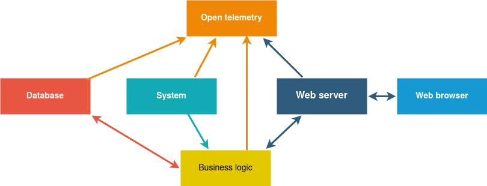

# Using gRPC to fight Mordor
## Hands on approach to use gRPC with `C++`

_Per-Magnus Holtmo_

---

# Micro service architecture



<!--
how to setup safe, stable, efficient, easy to work with
connection handling and messaging
-->

---

# Some alternatives

- REST - HTTP/1 and json
- MQTT
- RabbitMqQ, ZeroMQ, Kafka,...
- Implement your own using raw sockets
- Some needs a broker process
- or...


<!--
lots of alternatives
REST is common, especially for web or cloud based systems
json is human readable but takes space, parsing not that efficient
-->

---

# We could use gRPC

- Created by Google, open source 2015
- An RPC framework supporting most languages
- Uses Google Protocol buffers for data serialization
- HTTP/2 as transport layer

<!--
today I gonna tell you about gRPC and how it works
It is a very large library, will cover the basics

I wil explain concept using code examples - a lot of code
-->

---

# 'g' stands for Google, right?

---

# No, 'g' stands for...

- **1.0** 'g' stands for '**gRPC**'
- **1.1** 'g' stands for '**good**'
- **1.2** 'g' stands for '**green**'
- **1.3** 'g' stands for '**gentle**'
...
- **1.59** 'g' stands for '**generative**'
- **1.60** 'g' stands for '**gjallarhorn**'
- **1.61** 'g' stands for '**grand**'
- **1.62** 'g' stands for '**guardian**'


<!--
Depending on the application of course, the first two are the most common. 1 send or get data/settings to/from server. 2 can be used to subscribe to events on the server, which I'll show later
-->

---

# Lord of the rings game

<!--
Lets make a simple game engine for lord of the rings
we must stop sauron and mordor from taking over middle earth

I will skip some details and focus on the basics for better understanding
all details ara available in GitHub if anyone wants more

Will focus on code instead of bullets
Please interrupt with questions
-->

- Server exposing a gRPC service
- Service interface library
- Client applications
- Synchronous and asynchronous examples

---

# Interface library

- Define interface in a protocol buffers file: `.proto`
- Generate code
- Build a library

---

# Interface messages - lotr.proto

```proto
package lotr.proto;

message MordorPopulation {
    uint64 orc_count = 1;
    uint32 troll_count = 2;
    uint32 nazgul_count = 3;
    bool sauron_alive = 4;
}

message Weapon {
    string name = 1;
    float power = 2;
}

message AttackResult {
    uint64 orcs_killed = 1;
    uint32 trolls_killed = 2;
    uint32 nazguls_killed = 3;
}
```


<!--
gRpc uses google protobuf
package -> namespace,
message -> classed with getters and setters
add repeated field
-->

---

# Protocol buffers

Generate code for supported languages, e.g. as C++:
```sh
protoc -I include/path --cpp-out build/proto lotr.proto
```
Output:  `lotr.pb.h` and `lotr.pb.cc`

Serialize
```cpp
Weapon weapon;
weapon.set_name("Sting")
const auto data = weapon.SerializeAsString();
```
Deserialize

```cpp
Weapon weapon;
weapon.ParseFromString(data);
const auto name = weapon.name()
```

<!--
string is normally used as data buffer, can use array and streams
-->

<!--
---


# SKIP ???

- Can be used independently of gRPC
- Messages are defined in `.proto` files
  -  int, float, string, byte arrays, array of other messages
- Includes plugins to generate code for various languages
- Serializes/deserialize messages size and time efficiently
- `protoc` can generate `name.pb.h/cc` and `name.grpc.pb.h/cc` files.

```cpp
auto data = msg.SerializeAsString();

```
-->


<!--
will not go into details how to use the protocompiler, give it the protofile and out path
it will generate include and impl files (google mock code optional)
I have it all in cmake, will show you link at the end

---
-->


<!--
Depending on the use case, if the list of messages is known, one could use unary RPC with one message
containing an array of other messages
-->
---

# Interface functions - RPC

gRPC makes additions to the `.proto` files to define a Service.


```proto
service LotrService {
    rpc mordor_population(google.protobuf.Empty) returns (MordorPopulation) {}
    rpc kill_orcs(Weapon) returns (AttackResult) {}
    rpc subscribeToStatus(google.protobuf.Empty) returns (stream Status) {}
}
```

When running `protoc`

```sh
protoc --grpc_out=build/proto --plugin=protoc-gen-grpc=grpc_cpp_plugin lotr.proto
```
Output: `name.grpc.pb.h` and `name.grpc.pb.cc`


<!---
- Unary RPC
- Server streaming
- Client streaming
- Bidirectional streaming
-->

---

# Make a library with the interface code

Contains proto files and optional C++ helper types
Exposes needed headers for both server and client

```cmake
include(../cmake/grpc.cmake)

generate_proto_cpp(lotr-proto protos/lotr.proto)
```

<!---
- good practice
- used by both server and client
- can be given a version, generated at build time, can ask server for protocol version
- provides include paths to headers
-->

---

# Server concept

- Subclass generated service class (several options)
- Create a `grpc::Server` and add a service instance
- Start the server on the "ip:port" to listen on
- The server runs until shutdown by other thread
- Optionally enable reflection

```cpp
    grpc::reflection::InitProtoReflectionServerBuilderPlugin();
```
<!--
reflection: can make cli, query for service, methods, arguments and make calls
These are the basics, will make this step by step
-->
---

# Synchronous service definition

```cpp

#include <lotr.grpc.pb.h>

class SyncService : public proto::LotrService::Service
{
public:
    grpc::Status mordor_population(grpc::ServerContext* context,
                                   const google::protobuf::Empty* request,
                                   proto::MordorPopulation* response) override;
};
```
<!--
include generated file, subclass a service - many options, here the most simple for sync
override methods
server context needed for async only
-->
---

# Synchronous service implementation

```cpp
grpc::Status SyncService::mordor_population(grpc::ServerContext*,
                                            const google::protobuf::Empty*,
                                            proto::MordorPopulation* response)
{
    response->set_orc_count(2'345'543);
    response->set_troll_count(7'540);
    response->set_nazgul_count(9);

    return grpc::Status::OK;
}
```

<!--
for sync - skip context
no care about the empty request
returned Status - error code and message, predefined error codes
Called from a thread pool in grpc, ensure to guard shared data
-->

---

# We need a Server to host the service


```cpp
class GrpcServer
{
public:
    GrpcServer(grpc::Service& service, std::string_view address, uint16_t port);

    void shutdown();

private:
    void run(grpc::Service& service, const std::string& listening_uri);

    std::thread m_server_thread;
    std::unique_ptr<grpc::Server> m_server;
};
```
<!--
Generic, can be reused for any service
-->

---

# gRPC Server implementation

```cpp
void GrpcServer::run(grpc::Service& service, const std::string& listening_uri)
{
    grpc::ServerBuilder builder;
    builder.AddListeningPort(listening_uri, grpc::InsecureServerCredentials());
    builder.RegisterService(&service);
    m_server = builder.BuildAndStart();
    m_server->Wait();
}
```
```cpp
void GrpcServer::shutdown()
{
    if (m_server) {
        m_server->Shutdown();
        m_server_thread.join();
    }
}
```
---

# Time to make a client

- Generic client, holding gRPC _channel_ and _stub_
- Specialized client

---

# Generic client definition

```cpp
template<typename Service>
class GrpcClient
{
public:
    GrpcClient(const std::string& server_url)
      : m_channel{ grpc::CreateChannel(server_url,
                   grpc::InsecureChannelCredentials()) }
      , m_stub{ Service::NewStub(m_channel) } {}

    Service::Stub& stub() { return *m_stub.get(); }

private:
    std::shared_ptr<grpc::Channel> m_channel;
    std::unique_ptr<typename Service::Stub> m_stub;
};
```

<!--
Generic, can be reused for any service
- channel provides a connection to a gRPC server on a specified host and port
- stub is create on client side form the channel - provides function api
-->

---

# Synchronous client definition

```cpp
class SyncClient
{
public:
    SyncClient(std::string_view address, std::uint16_t port);

    std::optional<lotr::proto::MordorPopulation> population();

private:
    GrpcClient<lotr::proto::LotrService> m_grpc_client;
};
```

---

# Synchronous client implementation

<!--
```cpp
SyncClient::SyncClient(std::string_view address, std::uint16_t port)
  : m_grpc_client{ fmt::format("{}:{}", address, port) } {}
```
-->
```cpp
Stub::mordor_population(grpc::ClientContext* context,
                        const google::protobuf::Empty& request,
                        proto::MordorPopulation* response);
```

```cpp
std::optional<lotr::proto::MordorPopulation> SyncClient::population()
{
    grpc::ClientContext context;
    google::protobuf::Empty request;
    lotr::proto::MordorPopulation response;

    const auto status = m_grpc_client.stub().
        mordor_population(&context, request, &response);

    if (!status.ok()) {
        return std::nullopt;
    }

    return response;
}
```
---

# ClientContext options

Set deadline, how long to wait until call is aborted
```cpp
context.set_deadline(std::chrono::system_clock::now() + 2s);
```

Compression
```cpp
context.set_compression_algorithm(GRPC_COMPRESS_GZIP);
```

Add meta data, http header key value pairs
```cpp
context.AddMetadata("custom-header", "Custom Value");
```

And credentials, cancellation, keep alive, "wait for ready", etc...

---

# Demo synchronous messages

---

# We need asynchronous message handling

**Do not use the suggested async api!**

But there is a callback interface...

<!--
Way too much boiler plate
Completion queues, polling or waiting, threading etc etc, will not mention it

callback interface makes unary async calls very simple
stream calls still requires lot of extra code, maybe it will be improved as well
-->

---

# Asynchronous service definition

```cpp
class AsyncService : public proto::LotrService::CallbackService
{
public:
    AsyncService(boost::asio::io_context& context, const ServiceCallbacks& callbacks);

    grpc::ServerUnaryReactor* mordor_population(grpc::CallbackServerContext* context,
                                                const google::protobuf::Empty* request,
                                                proto::MordorPopulation* response) override;

    grpc::ServerUnaryReactor* kill_orcs(grpc::CallbackServerContext* context,
                                        const proto::Weapon* request,
                                        proto::AttackResult* response) override;
};
```

<!--
inherit from CallbackService
provide a boost asio context for threading/handover, callbacks to get data

new return types, return a reactor instead of status directly
new ServerContext
-->

---

# Asynchronous service implementation

```cpp
grpc::ServerUnaryReactor* AsyncService::mordor_population(grpc::CallbackServerContext* context,
                                                          const google::protobuf::Empty*,
                                                          proto::MordorPopulation* response)
{
    auto reactor = context->DefaultReactor();

    boost::asio::post(m_io_context, [reactor, response, this] {
        const auto pop = m_callbacks.population();

        response->set_orc_count(pop.orc_count);
        response->set_troll_count(pop.troll_count);
        response->set_nazgul_count(pop.nazgul_count);
        response->set_sauron_alive(pop.sauron_alive);

        reactor->Finish(grpc::Status::OK);
    });

    return reactor;
}
```

<!--
called by grpc thread, must return directly
for unary calls, there is a simple reactor to use, return directly, later call Finish() on it to
return to client

using boost asio to handover to main thread, access state
access state, set response, call Finish()

common setup, we could add helper function, we could check arguments, add error handling
will show in a bit

BUT there is a problem with this simple setup
When se are shutting down the server, the main thread is about to stop grpc server
there might come a call, post to asio context, will never be run and finish will never be called
-->

---

# UnaryExecutor

```cpp
class UnaryExecutor
{
public:
    explicit UnaryExecutor(boost::asio::io_context& context);

    void shutdown();

    grpc::ServerUnaryReactor* execute(grpc::CallbackServerContext* callback_context,
                                      const std::function<grpc::Status()>& work);

private:
    boost::asio::io_context& m_io_context;
    bool m_block{ false };
};
```

---

# UnaryExecutor

```cpp
void UnaryExecutor::shutdown()
{
    m_block = true;
}

grpc::ServerUnaryReactor* UnaryExecutor::execute(grpc::CallbackServerContext* callback_context,
                                                 const std::function<grpc::Status()>& work)
{
    auto reactor = callback_context->DefaultReactor();

    if (m_block) {
        reactor->Finish(grpc::Status::CANCELLED);
        return reactor;
    }

    boost::asio::post(m_io_context, [reactor, work]() {
        const auto status = work();
        reactor->Finish(std::move(status));
    });

    return reactor;
}
```
<!--
Class, has a asio context and a blocking flag
execute(), provide function that returns gprc status
if block, set cancel and return
otherwise, call func and mark the result

Let's see how it can be used
-->
---

# UnaryExecutor usage

```cpp
grpc::ServerUnaryReactor* AsyncService::kill_orcs(grpc::CallbackServerContext* context,
                                                  const proto::Weapon* request,
                                                  proto::AttackResult* response)
{
    if (request->power() < 0 || request->power() > 1) {
        auto reactor = context->DefaultReactor();
        reactor->Finish({ grpc::StatusCode::INVALID_ARGUMENT, "Power must be between 0 and 1" });
        return reactor;
    }

    return m_executor.execute(context, [this, request, response]() {
        const auto result = m_callbacks.kill_orcs(request->name(), request->power());
        if (!result) {
            return grpc::Status{ grpc::StatusCode::INTERNAL, "Too late, Sauron has taken over" };
        }

        response->set_orcs_killed(result.value());
        return grpc::Status::OK;
    });
}
```
<!--
In our overridden function,
first quick check of arguments
the call execute(), providing a simple function, only focusing on the state handling
 - called on main thread
 - check result
 - fill response
-->

---

# Async client definition

```cpp
class AsyncClient
{
public:
    AsyncClient(boost::asio::io_context& context, std::string_view address, std::uint16_t port);

    using KillHandler = std::function<void(const grpc::Status&, std::uint64_t)>;

    void kill_orcs(std::string_view weapon_name, float power, KillHandler handler);

private:
    boost::asio::io_context& m_io_context;
    utils::GrpcClient<lotr::proto::LotrService> m_grpc_client;
};
```

<!--
similar to the sync client
here we use boost asio to do the work

here we have void functions, but provide a callback

-->

---

# gRPC client callback interface

```cpp
stub().async()->kill_orcs(grpc::ClientContext* context,
                          const proto::Weapon* request,
                          proto::AttackResult* response,
                          std::function<void(grpc::Status)> f);
```

```cpp
template<typename Request, typename Response>
struct ClientState
{
    grpc::ClientContext context;
    Request request;
    Response response;
};
```

<!--
for the sync case, we used function on the stub directly
and there is an async object where the callback functions hide

provide a context, request, response, and a callback with the status result
this func will return directly, but we need to keep track of the provided objects
they muse be kept in memory until the callback is called. And there may be many calls before
the first returns....

so that is the state we must store util done
-->
---

# Async client implementation


```cpp
void AsyncClient::kill_orcs(std::string_view weapon_name, float power, KillHandler handler)
{
    auto state =
      std::make_shared<utils::ClientState<lotr::proto::Weapon, lotr::proto::AttackResult>>();

    state->request.set_name(std::string(weapon_name));
    state->request.set_power(power);

    m_grpc_client.stub().async()->kill_orcs(
      &state->context,
      &state->request,
      &state->response,
      [&io_context = m_io_context, state, handler = std::move(handler)](grpc::Status status) {
          boost::asio::post(
            io_context,
            [handler = std::move(handler), status, orcs_killed = state->response.orcs_killed()]() {
                handler(status, orcs_killed);
            });
      });
}
```

<!--
Create the state as a shared pointer
- set request values, optional context options

call function, provide pointers to objects
and a lambda for the status result, capture the state in a lambda to keep it alive, handler

callback called by grpc, must handover to our main thread, here using boost asio again

call handler with result on main thread

-->
---

# Some streaming

---

# Same as done on neti ???

---

# Python client

---

# Typescript client


---

# Advantages

- an API contract, typed function calls (REST normally uses json strings)
- arguments are efficiently serialized using protobuf
- code generation for messages and server/client stubs in "any" language. (can be different)
- support implementation wither side in "any" language
- supports streaming, i.e. one end sends messages continuously
- http/2 gives more efficient and long lived connections, compared to http/1. gives TLS support if required

---

# Disadvantages

- complex and large code base
- not the best documentation
- several ways to do the same thing
- synchronous/asynchronous
here I gonna explain one way with asynchronous support
- requires large code base
- build, conan,
- requires http2 - cannot directly access from most browsers, need to run a proxy that converts http/1 <> htt/2

---

# Not covered


- Clients in other languages, e.g. Python or Typescript
- Authentication and encryption

---

# Thank you

- link to GitHub
- email?
